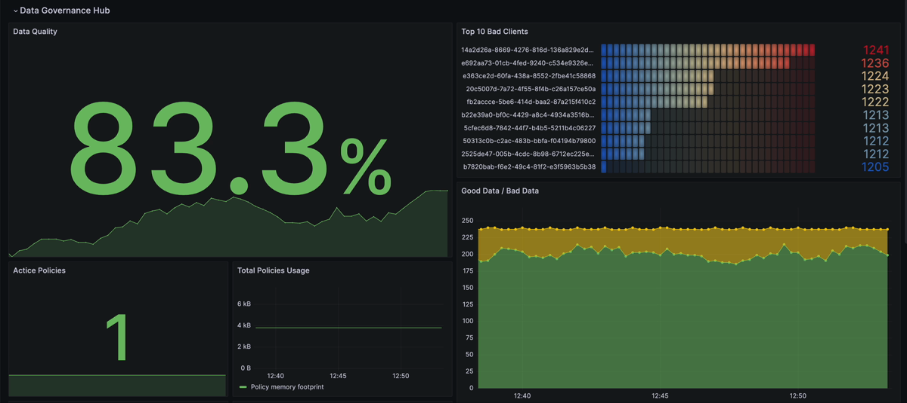

# Flagging Bad Clients

This repository showcases to flag clients that publishes bad data. 
The code exemplifies a scenario where clients publish data in a prescribed JSON format, but certain messages fail validation. 
The solution incorporates the [UserProperties.add](https://docs.hivemq.com/hivemq/4.16/data-governance-hub/policies.html#user-properties-add-function)
and [Delivery.redirectTo](https://docs.hivemq.com/hivemq/4.16/data-governance-hub/policies.html#delivery-redirect-to-function)
functions to add MQTT user properties and redirect invalid messages.
To each redirected message we add user properties to identify bad clients and to analyze the failure.

## Requirements
- [Docker](https://www.docker.com/) 
- [Docker compose](https://docs.docker.com/compose/) 
- A HiveMQ license with enabled Data Governance Hub (contact [datagovernancehub@hivemq.com](mailto:datagovernancehub@hivemq.com))
- A [HiveMQ Enterprise Extension for PostgreSQL](https://www.hivemq.com/extension/postgresql-extension/) license. If no license is provided, a trial license is valid for 5 hours.
Please add your license according the [Dockerfile](hivemq/Dockerfile) 
## Quickstart

1. Place your HiveMQ license with enabled Data Governance Hub under `hivemq/hivemq.lic`
2. Execute `docker compose up`
3. Execute `mqtt sub -t 'invalid/#' -J` to see redirected MQTT messages from bad clients
4. Go to http://localhost:3000 and open the pre-defined Grafana Dashboard (credentials: admin, grafana)