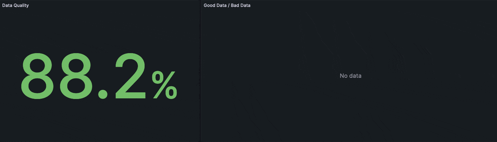

# Quality Metric Example

This directory showcases an implementation of a quality metric for data pipelines. 
The code provides an example of a scenario where clients publish data in a prescribed JSON format, but certain messages fail validation. 
The solution incorporates the [Metrics.Counter.increment](https://docs.hivemq.com/hivemq/4.16/data-governance-hub/policies.html#metrics-counter-increment-function) function to increment custom counter metrics for the number of valid and invalid payloads.
These metrics are then utilized to derive a metric of overall data quality, which is subsequently visualized on a Grafana dashboard.

## Requirements
- [Docker](https://www.docker.com/) 
- [Docker compose](https://docs.docker.com/compose/) 
- Optional: 
  - (**License**): If you have a HiveMQ license with Data Governance Hub copy the file into the container. Check the commented line in `docker-compose.yml` 
  - (**Non-License**): In case you don't have a license, the trial mode is activated which stays active for 5 hours. Check out the [documentation](https://docs.hivemq.com/hivemq/4.17/data-governance-hub/#activate-trial-mode) how to activate the trial mode.

## Quickstart

1. In this directory, execute `docker compose up`
2. Go to http://localhost:3000 and open the pre-defined Grafana Dashboard (credentials: admin, grafana)