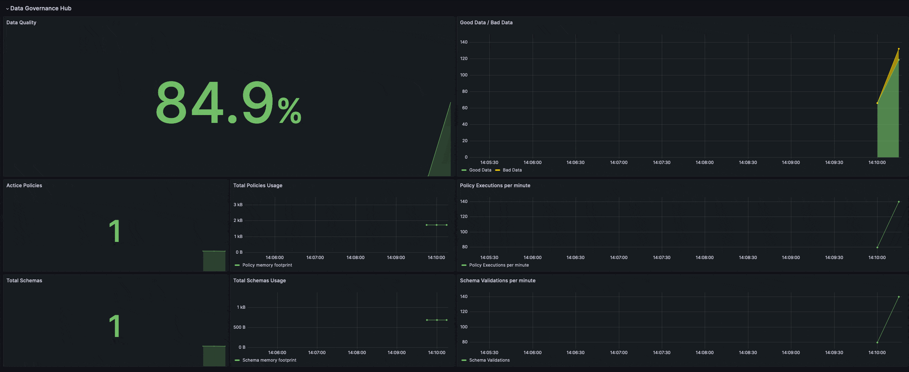

# Quality Metric Example

This directory showcases an implementation of a quality metric for data pipelines. 
The code provides an example of a scenario where clients publish data in a prescribed JSON format, but certain messages fail validation. 
The solution incorporates the [Metrics.Counter.increment](https://docs.hivemq.com/hivemq/4.16/data-governance-hub/policies.html#metrics-counter-increment-function) function to increment custom counter metrics for the number of valid and invalid payloads.
These metrics are then utilized to derive a metric of overall data quality, which is subsequently visualized on a Grafana dashboard.

## Requirements
- [Docker](https://www.docker.com/) 
- [Docker compose](https://docs.docker.com/compose/) 
- A HiveMQ license with enabled Data Governance Hub (contact [datagovernancehub@hivemq.com](mailto:datagovernancehub@hivemq.com))

## Quickstart

1. Move your HiveMQ license with Data Governance Hub enabled to `hivemq/hivemq.lic`
2. In this directory, execute `docker compose up`
3. Go to http://localhost:3000 and open the pre-defined Grafana Dashboard (credentials: admin, grafana)